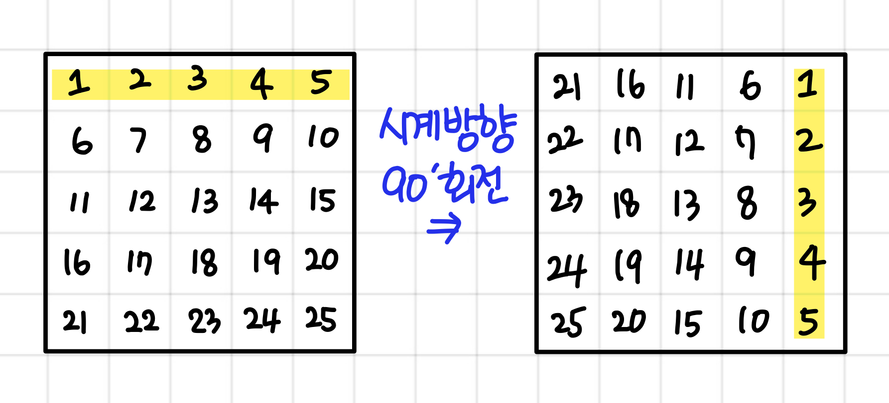
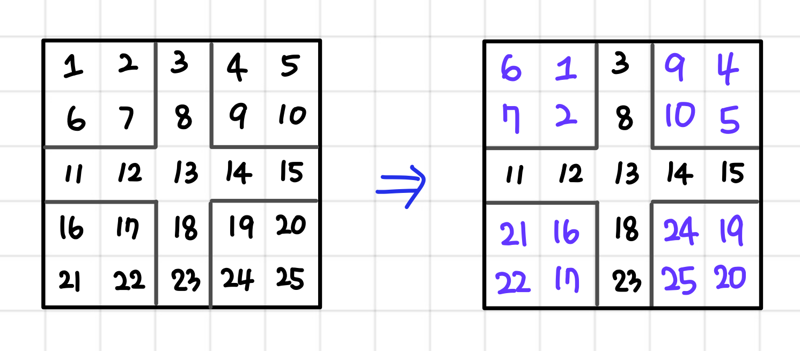
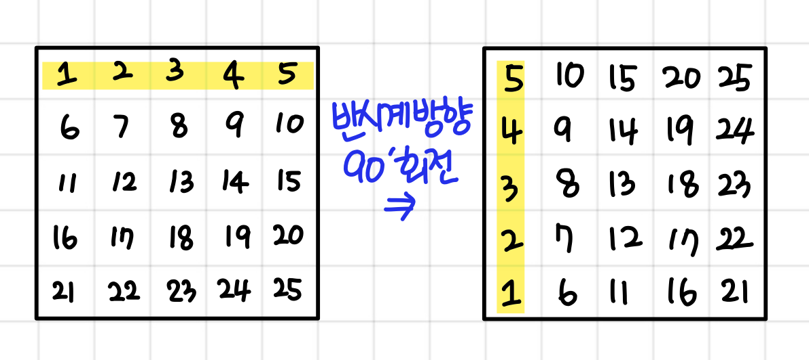
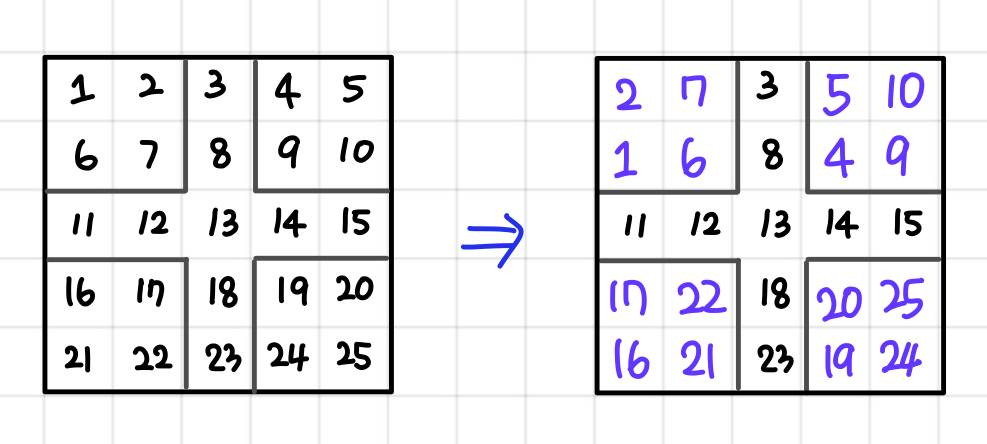

# Rotate

> 참고 링크 : https://velog.io/@danbibibi/2%EC%B0%A8%EC%9B%90-%EB%B0%B0%EC%97%B4%EC%97%90%EC%84%9C-90%EB%8F%84-%ED%9A%8C%EC%A0%84-%EC%95%8C%EA%B3%A0%EB%A6%AC%EC%A6%98

## 배열을 90도 회전 시키는 법



- 길이 5

(0,0) -> (0,4)
(0,1) -> (1,4)
(0,2) -> (2,4)
(0,3) -> (3,4)
(0,4) -> (4,4)

결국 
x값은 : y 값을 가져온다.
y값은 : 길이 - x값 -1 과 같은 식이 된다.

```
for(int i=0; i<N; i++){
	for(int j=0; j<N; j++) tmp_arr[j][N-1-i] = arr[i][j];
}
```

로직이 헷갈린다면 맨 끝 라인을 옮기고 생각해보자.

## 배열 특정 구간 시계 방향 회전

당연히 짝수라면 문제가 된다. ( 2칸, 1칸 분배 )



```
void rotate_square(int y1, int x1) {
	int mid = n / 2;
	for (int i = 0; i < mid; i++) {
		for (int j = 0; j < mid; j++) tmp_arr[y1 + j][x1 + mid - i - 1] = arr[y1 + i][x1 + j];
	}
}

// 정사각형 시계 방향 90' 회전
int mid = n / 2;
rotate_square(0, 0); // 좌상
rotate_square(0, mid + 1); // 우상
rotate_square(mid + 1, 0); // 좌하
rotate_square(mid + 1, mid + 1); // 우하
```

x1 + mid 가 기존의 N이다. - 최대 길이 이므로

길이가 5라고 가정하면? -> x1 + mid = 0~2

## 반시계 방향 90도 회전

위와 성격이 같다.



(0,0) -> (4,0)
(0,1) -> (3,0)
(0,2) -> (2,0)
(0,3) -> (1,0)
(0,4) -> (0,0)

x값은 : 길이 - y값 -1 과 같은 식이 된다.
y값은 : x 값을 가져온다.

```
for(int i=0; i<N; i++){
	for(int j=0; j<N; j++) tmp_arr[N-1-j][i] = arr[i][j];
}
```

## 배열 특정 구간 반시계 방향 회전 



```java
public void rotate(int x, int y) {
    int size = N / 2;
    for (int i = 0; i < x; i++) {
        for (int j = 0; j < y; j++) {
            tmp_arr[size + x - j - 1][i + y] = arr[i + y][j + y];
        }
    }
}
```
---

## Sample Kotlin Code

```kotlin
package week5

fun main() {
    val ary = Array(3) { IntArray(3) }

    var count = 1
    for (i in ary.indices) {
        for (j in ary.indices) {
            ary[i][j] = count++
        }
    }

//    [1, 2, 3]
//    [4, 5, 6]
//    [7, 8, 9]

//    [7, 4, 1]
//    [8, 5, 2]
//    [9, 6, 3]
    println(rotation(ary).contentDeepToString())
}

fun rotation(ary: Array<IntArray>): Array<IntArray> {
    val size = ary.size
    val tmp = Array(size) { IntArray(size) }
    for (i in ary.indices) {
        for (j in ary.indices) {
            tmp[j][size - 1 - i] = ary[i][j]
        }
    }
    return tmp
}
```

만약 4방향 전부 확인하고 싶다면?
```kotlin
var temp = key
repeat(4){
    temp = rotate(temp)
}
```
와 같이 4번 반복하자.
