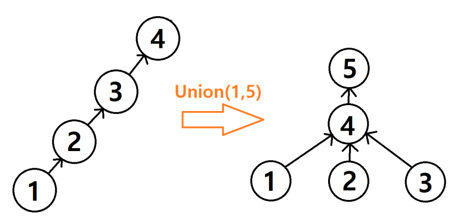

# Union

말 그대로 집합을 찾는 과정이다.

```kotlin
fun find(number:Int,ary:IntArray):Int{
    if(ary[number]== number) return number
    return find(ary[number],ary)
}
```

재귀적으로, 자신의 부모를 거슬러 맨위 Root 값을 찾는다.
이때, 명시적으로 범위가 더 작거나/크거나 를 기반으로 값을 넣는다.

```kotlin
fun union(a:Int,b:Int){
    aIndex = find(a)
    bIndex = find(b)
    if(ary[aIndex]>ary[bIndex]){
        ary[aIndex] = ary[bIndex]
    }else{
        ary[bIndex] = ary[aIndex]
    }
    // ... 추가적인 작업
}
```
자기의 선조를 찾아서, 그 값을 연결한다.

4 -> 1
3 -> 1
5 -> 4 ( 5 -> 4 -> 1 을 통해 5 -> 1이 된다. )

## 경로 압축

가끔씩 일반 Union 을 하면, 시간 초과가 나는 경우가 있다.
https://www.acmicpc.net/problem/1717

이때는, 경로를 압축해야 한다.

```kotlin
fun find(a:Int,ary:IntArray):Int{
    if(ary[a]==a)return a
    ary[a] = find(ary[a],ary)
    return ary
}
```


이와같이 값이 재 정리 된다.

> 당연히, 몇번을 거쳐 교집합이 되는지와 같은 로직이 있다면 압축을 하면 안된다. 
