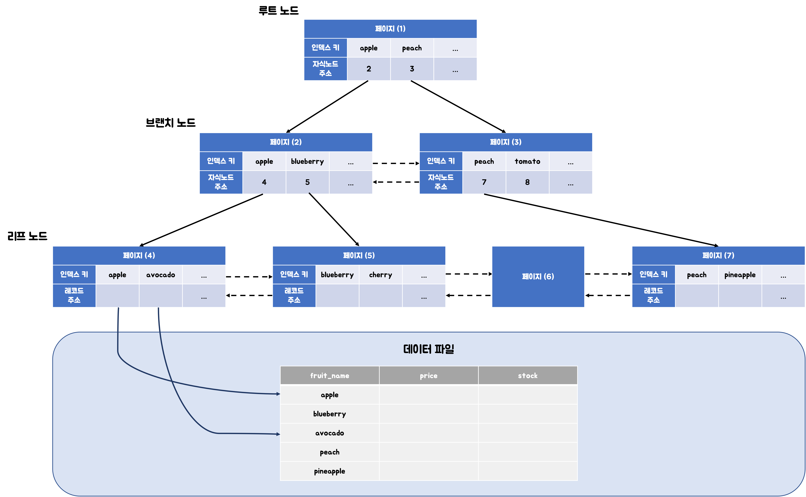

# Index

```sql
select *
from customer
where first_name = 'Minsoo';
```

index 가 걸려있지 않다면?
-> FULL SCAN 으로 찾아야 한다. O(N)

index 가 걸려있다면?
-> INDEX SCAN 을 할 수 있다. O(log(N)) - B Tree 기준

=> 조건을 만족하는 튜플(들)을 빠르게 조회하기 위해
=> 빠르게 정렬(order by)하거나 그룹핑(group by) 하기 위해

## INDEX 만드는 법

```sql
CREATE INDEX <인덱스 명> ON <테이블 명>(<칼럼 명>);
CREATE INDEX <인덱스 명> ON <테이블 명>(<칼럼 명>,<칼럼 명>);
CREATE UNIQUE INDEX <인덱스 명> ON <테이블 명>(<칼럼 명>);
```

```sql
CREATE TABLE <테이블 명>(
    ...
    INDEX <인덱스 명-생략 가능> (<칼럼 명>)
    UNIQUE INDEX <인덱스 명-생략 가능> (<칼럼 명>)
)
```

- PRIMARY KEY 는 index 가 자동 생성된다.

## INDEX 조회

```sql
SHOW INDEX FROM <테이블 명>;
```


- Table: 테이블 명
- Non_unique: 유니크 여부
- Key_name : 인덱스 이름 ( 여러 컬럼을 건 인덱스 일 수 있으므로 )
- Seq_in_index : 인덱스 내 칼럼 순서
- Column_name : 칼럼 명
- Null : NULL 여부

## B-TREE



- 가장 작은 값부터 정렬을 해서 저장한다.
- 실제 TABLE 튜플에 대한 주소를 가지고 있는다.

`WHERE a = 7`
-> A에 대한 인덱스 있을 시, 타서 들어간다.

`WEHERE a = 7 AND b = 95`
-> A에 대한 인덱스는 타나, B에 대한 것은 A 필터링 기반 전부 조회한다.
=> A,B 를 묶은 인덱스가 필요하다.


A 기반 먼저 정렬, B기반 정렬

> 이때, `WHERE b = 95` 와 같은 조회는 해당 인덱스를 타지 못한다.
> A를 기반으로 정렬되어 있기 때문 ( B에 대한 별도 인덱스가 필요 )
> 
> `WHERE a = 95` 와 같은 조회는 해당 인덱스를 탄다.
> A를 기반으로 정렬되어 있으니 활용 가능

### 인덱스를 타지 못하는 경우

```
<>, NOT IN, NOT BETWEEN, IS NOT NULL
LIKE '%??'
SUBSTRING(index, 1, 1), DAYOFMONTH(index)
WHERE char_index = 10
INDEX (first_column, second_column) 일 때 WHERE second_column = some_value
```

명확하게 조회할 수 없으므로 인덱스를 타지 못한다.

## 실행계획 분석

```sql
EXPLAIN <쿼리명>;
```
옵티마이저가 알아서 index 를 선택해준다.


type 컬럼은 반드시 확인해야 한다.

### type

쿼리르 실행할 때 인덱스를 사용했는지, 테이블을 처음부터 끝까지 읽는지 나타냄
-> 효율적으로 사용하고 있는지 판별할 수 있다.

- const : 조회되는 데이터가 단 1건일 때
- eq_ref : 조인에서 처음 읽은 데이터 컬럼값, 그 다음 읽어야 할 테이블의 PK 혹은 UK 컬럼의 검색 조건에 사용할 때 ( 단 1건 데이터 존재 )
- ref : 인덱스의 종류와 관계 없이 동등 조건 검색
- range : 인덱스 이용해 범위 검색할 때
- index : 인덱스 전체 스캔할 때
- all : 테이블 전체 스캔할 때

> 쿼리문에 USE INDEX(<인덱스명>) 을 통해
> 특정 인덱스 사용을 지정할 수 있다. ( 하지만, 권장 사항 )

> FORCE INDEX(<인덱스명>) 을 사용해야
> 무조건 지정 인덱스를 사용한다.

> IGNORE INDEX(<인덱스명>) 을 통해
> 특정 인덱스를 무시하게 할 수 있다.

## Index TradeOff

table 에 write 할 때마다 index 도 변경 발생한다.
`+` 추가적인 저장 공간도 차지

=> 불필요한 index 는 최대한 만들지 말아야 한다.

- 데이터 저장(WRITE) 성능을 희생하고, 그 대신 데이터 읽기(READ) 성능을 높이는 기능
- 데이터 저장(INSERT,UPDATE,DELETE) 후 추가로 인덱스 변경
- 메모리 추가 사용

`cardinality`와 서비스 쿼리에서 얼마나 사용되는지 따라 결정하자

## Covering Index

```sql
SELECT team_id, backnumber FROM player WHERE team_id = 5;
```

`INDEX(tem_id,backnumber)` 와 같은 인덱스가 있을시, 테이블을 직접 조회할 필요가 없다.

-> 이를 커버링 인덱스라고 한다.
( 조회하는 attributes 를 index 가 모두 cover 할 때 )

## Hash Index

hash table 사용해 index 구현


- 시간 복잡도 O(1) 성능
- rehashing 에 대한 부담
- equality 비교만 가능, range 비교 불가능
- multicolumn index 경우 전체 attributes 에 대한 조회만 가능

## 기타

- order by나 group by 에도 index 가 사용될 수 있다.
- foreign key에는 index가 자동으로 생성되지 않을 수 있다 ( join 관련 )
- 데이터가 몇 백만 건 이상 있는 테이블에 인덱스 생성 시, 시간이 몇 분 소요 및 DB 성능에 영향을 준다.

---

## Full Scan 이 더 좋은 경우

table 에 데이터가 조금 있을 때 ( 몇 십,백건 정도)
조회하려는 데이터가 테이블의 상당 부분을 차지할 때 ( 즉, 카디널리티가 비효율일때 )
