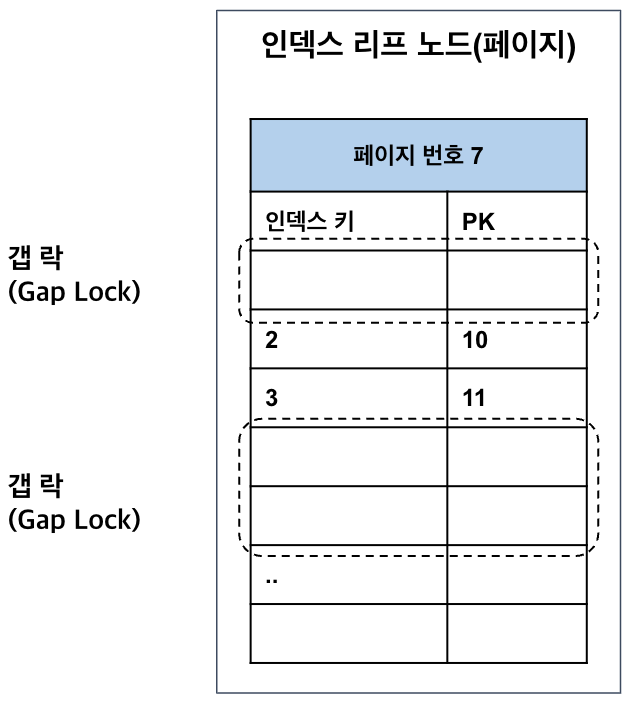

# 스토리지 엔진 수준의 락

테이블의 데이터를 다루기 위한 락

## 레코드 락

테이블 레코드 자체를 잠구는 락이다.
상당히 작은 공간으로 관리 + 레코드 -> 페이지 -> 테이블 락으로 레벨업되는 경우 X ( 락 에스컬레이션 )

⭐⭐MySQL 의 레코드 락은 테이블 레코드가 아닌 인덱스 레코드를 잠근다.

락이 걸리는 인덱스는 클러스터 인덱스(PK) 및 논클러스터 인덱스(세컨더리 인덱스) 모두를 포함한다.
PK가 없는 테이블이라면 내부적으로 자동 생성된 PK 이용해 설정 - 숨겨진 클러터 인덱스 ( Row ID )

인덱스 레코드에 락을 거는 것과 테이블 레코드에 락을 거는 것은 큰 차이가 있다.

```sql
select count(*) from employees where first_name = 'Georgi';
-> 253

select count(*) from employees where first_name = 'Georgi' AND last_name='Klassen';
-> 1

UPDATE employees SET hire_date=NOW() WHERE first_name='Georgi' AND last_name='Klassen';
```

first_name 에 해당하는 인덱스만 있다면?
-> 253개의 레코드가 모두 잠긴다.
=> 동시성이 상당히 떨어진다.

보조 인덱스만 있으면 불필요하게 많은 레코드가 잠긴다.
( 검색된 레코드들에 클러스터드 인덱스 레코드로 잠금 정보를 유지하므로 )

## 갭 락

레코드와 레코드 사이 간격을 잠금한다.
-> 레코드 생성, 수정 및 삭제를 제어

아직 존재하지 않지만 지정된 범위 해당하는 인덱스 테이블 공간을 대상으로 거는 잠금이다.



1이상 5이하의 조건으로 데이터 검색시, 2와 3에 걸리는 락이 레코드 락
실존하지 않는 1과 4,5 가 추가될 수 있는 공간에 걸리는 락이 갭락
-> 레코드와 레코드 사이 간격에 새로운 레코드 생성하는 걸 제어

## 넥스트 키 락

레코드 락과 갭 락을 합쳐놓은 형태이다.

`SELECT ... WHERE ...` 범위 조회 이후, 동일 트랜잭션 내 동일 쿼리 재실행 때 결과가 변화는걸 막는다. - 팬텀 현상 방지
-> `REPETABLE READ` 격리수준 사용한다면 필요

`STATEMENT` 포맷을 쓰는 경우 마스터 - 래플리카에서 동일 쿼리 실행할 때 결과 달라지지 않기 위해 필요하다.

SELECT * FROM employees WHERE emp_no = 1001 FOR UPDATE;
-> 데이터 유일성 보장하는 PK 또는 유니크 인덱스 에선 단순 레코드 락 사용


> MySQL 8.0 에선 ROW 포맷 바이너리 로그가 기본 설정으로 변경
> -> 넥스트 키 락이나 갭 락이 줄어든다.

## 자동 증가 락

### `innodb_autoinc_lock_mode=0 or 1`

테이블 수준의 잠금
자동 증가하는 숫자 `AUTO_INCREMENT` 컬럼 속성에 사용한다.
동시에 여러 레코드에 INSERT 가 되어도, 중복되지 않고 저장된 순서대로 증가하는 일련번호를 가진다.

트랜잭션과 관계없이 가져오는 순간만 락이 걸렸다가 즉시 해제
-> 동시 실행 시, 나머지 쿼리는 자동 증가 락을 기다린다.

> 5.1 이상부터는 `innodb_autoinc_lock_mode` 시스템 변수를 이용해 락 방식 변경 가능하다.
> 위 방식은 5.0 까지로 자동 증가 `락`

### `innodb_autoinc_lock_mode=2`

InnoDB 스토리지 엔진에서 자동 증가 락을 걸지 않고 경량화된 레치(뮤텍스) 사용

- 하나의 INSERT 이더라도 연속된 자동 증가 값 보장하지 않는다.
- 인터리빙 모드 ( Interleaved mode )

`INSERT ... VALUES` 와 같은 대량 INSERT 문장에도 다른 커넥션이 INSERT 를 수행할 수 있다.
-> 동시 처리 성능 높아짐, 레코드 번호는 연속하지 않을 수 있음

> STATEMENT 포맷 바이너리 로그이면, 소스 서버와 래플리카 서버 자동 증가 값이 달라질 수 있다.
> ( MySQL 8 부턴 기본값 2, STATEMENT 포맷을 쓴다면 1로 변경해서 사용하자 )
