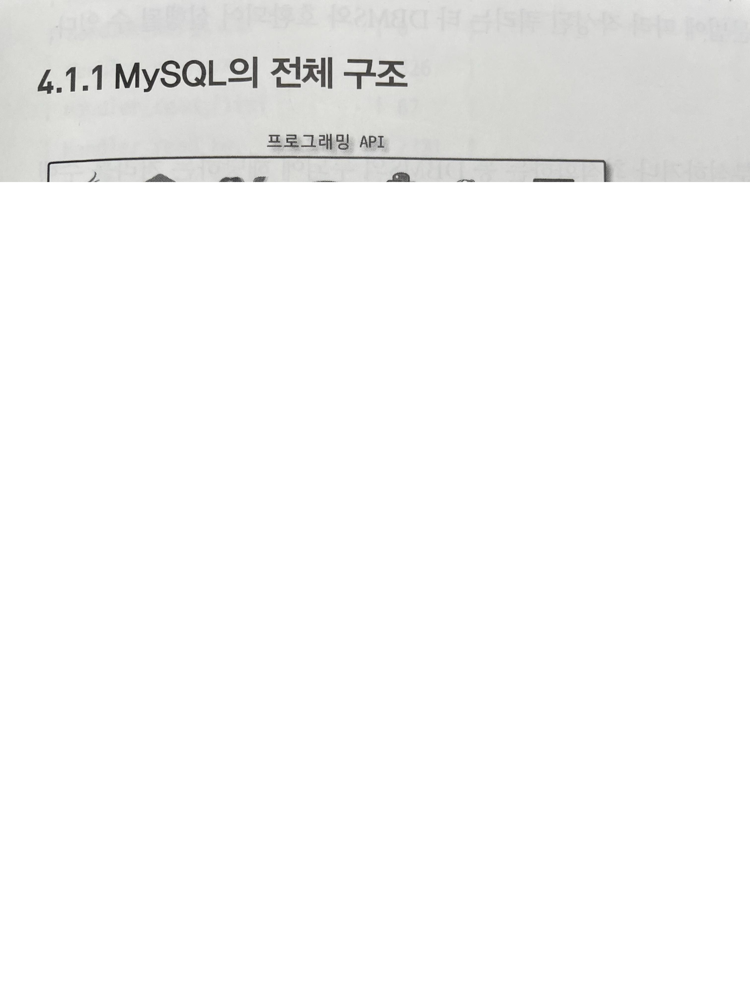
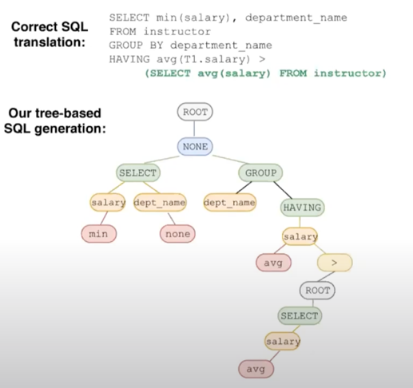

# MySQL Architecture

MySQL 서버는 사람의 머리 역활 담당인 `MySQL 엔진` + 손발 역할인 `스토리지 엔진` 으로 구분할 수 있다.
(`+` 프로그래밍 API 를 제공해준다.)
다른 DBMS 에 비해 구조가 독특한 편

## MySQL 엔진

### Connection Handler

스레드 기반 동작
클라이언트마다 별도 스레드를 할당
MySQL 은 8.0부터 스레드 풀 지원

### Query Cache - Deprecated

SQL 실행 결과를 메모리에 캐싱하는 역할
동일 SQL 실행시 이전 결과 즉시 반환
테이블의 데이터가 변경되면 캐싱된 데이터 삭제 필요 - 동시 처리 성능 저하
-> MySQL 8.0 부터 완전히 제거됨

### Parser & Optimizer

#### Parser

클라이언트에 들어온 SQL 을 파싱해 구문 오류 없는지 검사
- SQl 문장을 토큰으로 쪼개서 트리로 만듬
- 쿼리 문장 기본 문법 오류 체크

추가로, 여기서 전처리가 일어난다.
- 구문 트리에 대한 추가적인 검사 수행 - 테이블, 컬럼 이름 해석 & 존재하지 않는 객체 및 권한 체크
- 불필요한 별칭 및 괄호 제거

#### Optimizer

옵티마이저가 SQL 실행을 최적화해서 가장 효율적인 실행 계획 수립

- 규칙 기반 최적화 : 옵티마이저에 내장된 우선순위에 따라 실행계획 수립
- 비용 기반 최적화 : 작업의 비용과 대상 테이블의 통계 정보를 활용해 실행 계획 수립

쿼리 변환, 조건 재배치로 검색 공간을 줄이거나 비용 모델을 적용해 예상 비용 계산 - 테이블 조인 순서, 인덱스 선택, 조인 방식 선택등 이루어짐.

### Query Execution Engine

옵티마이저가 만든 실행 계획을 기반으로 스트로지 엔진을 호출해서 실제로 데이터를 조회하거나 수정
`InnoDB` 같은 스토리지 엔진이 사용

### Cache & Buffer Pool

- InnoDB Buffer Pool : 디스크 I/O 를 줄이기 위한 페이지 캐시
- Redo Log Buffer : 변경된 데이터를 영구 저장 전 기록하는 버퍼
- Change Buffer : 인덱스 변경 사항 모아둠

## Storage Engine

MySQL 에서 데이터 저장하고 관리하는 역할
MySQL 5.5부터 기본 InnoDB ( 트랜잭션 지원 )

쿼리 실행이 요청하는 대로 데이터를 디스크로 저장하고 읽음
여러개를 동시에 사용 가능하다.
핸들러 API 에 의해 동작 ( 그래서, 핸들러라고도 불린다. )
플러그인 형태로 제공

> 플러그인은 한계가 있다.
> 플러그인 끼리 통신 불가능
> MySQL 서버 변수나 함수 직접 호출해 캡슐화를 위반
> -> 8.0부터 컴포넌트 아키텍처를 도입
