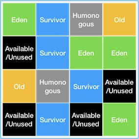
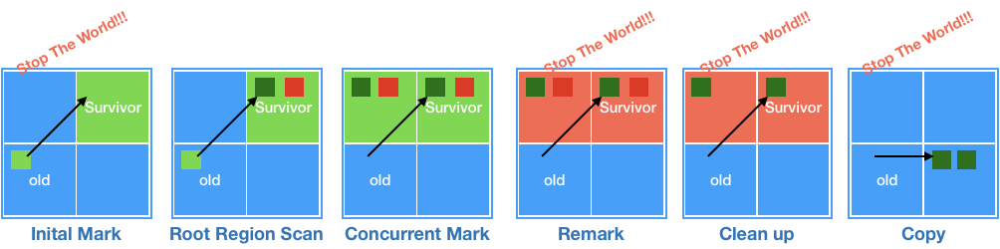
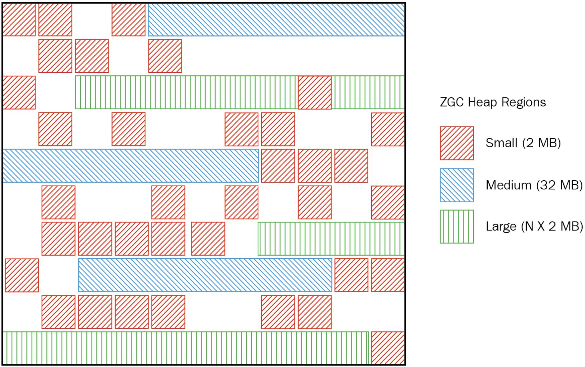
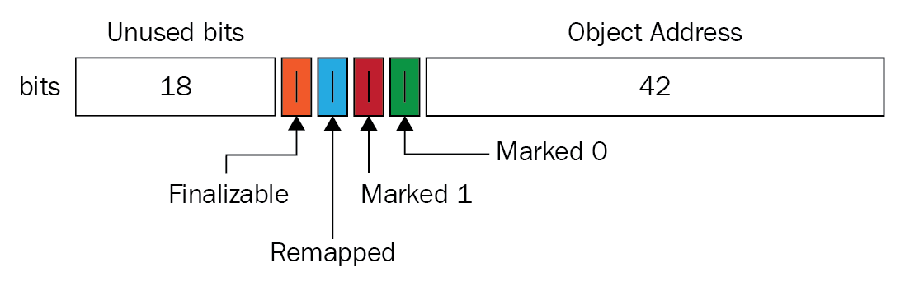

 # GC Algorithm
 
> 학습 링크 :
> https://blog.leaphop.co.kr/blogs/42/G1GC_Garbage_Collector%EC%97%90_%EB%8C%80%ED%95%B4_%EC%95%8C%EC%95%84%EB%B3%B4%EA%B8%B0___1
> https://d2.naver.com/helloworld/0128759
> https://lob-dev.tistory.com/65

> 사용하는 GC 확인하는 방법
> java -XX:+PrintFlagsFinal -version | grep GC | grep Use
> bool UseG1GC                                  = true                                      {product} {ergonomic}
> bool UseParallelGC                            = false                                     {product} {default}
> bool UseSerialGC                              = false                                     {product} {default}
> bool UseShenandoahGC                          = false                                     {product} {default}
> bool UseZGC                                   = false                                     {product} {default}

- Java 8 : Parallel GC
- Java 11 : G1 GC ( ZGC 등장 )
- Java 17 : G1 GC
- Java 21 : G1 GC

## Serial GC

Young 은 Mark Sweep 대로 수행
Old 은 Mark Sweep Compact 알고리즘으로 수행

- Compact : 영역 정리한 유효한 객체를 앞 부분부터 채움
- CPU 코어 1개일 때 사용하기 위해 개발되었다. ( 코어가 여러개인 서버에선 쓸 필요 X )

## Parallel GC

Serial 과 동일하나, 여러 개 스레드 통해 Parallel 하게 수행

- GC 오버헤드를 상당히 줄임
- Java 8까지 기본 GC

## CMS GC

Concurrent Mark Sweep GC
응답이 느릴 순 있어도 멈추지 않게 함

- 다른 GC 방식보다 메모리와 CPU 더 많이 필요, Compaction 단계를 수행하지 않음
  - Compaction 단계 수행 시, 오히려 STW 가 더 길어질 수 있음
- Java 9 에서 Deprecated, Java 14 에서 Drop

## G1 GC

Java 9에서 등장
 
Region 개념을 도입
기존 Heap 을 여러 개 지역으로 나누고, 역할과 함께 논리적 구분
`humongous` 와 `Available/Unused` 추가

- humongous : Region 크기 50% 초과하는 객체 저장 Region
- Available / Unused : 사용되지 않는 Region 

### Minor GC

한 지역 객체 할당 후 꽉 차면, 다른 지역 객체 할당해 Minor GC 실행
-> G1 GC 가 각 지역을 추적하므로, 가비지가 가장 많은 지역 Mark & Sweep 수행

- Eden 에서 Available/Unused 복제시 Survivor 영역 ( Eden 영역은 Available / Unused )

### Major GC ( Full GC )

시스템 운영 중, 객체가 너무 많아 빠르게 메모리를 할 수 없을 떄 Major GC 실행

GC 수행할 지역을 조합해 해당 지역들에 대해서만 GC 수행
( + Concurrent 하게 수행되기 때문에 애플리케이션 지연도 최소화 가능 )

1. Initial Mark : Old Region에 존재하는 객체 참조하는 Survivor Region 찾음 - STW 발생
2. Root Region Scan : Initial Mark 에서 찾은 Survivor Region에 대한 GC 대상 객체 스캔 작업 진행
3. Concurrent Mark : 전체 힙의 Region 대해 스캔 작업 진행, GC 대상 객체 아닐 시, 이후 단계 처리에 제외되게 마킹
4. Remark : STW 발생 후, 최종적으로 GC 대상에서 제외될 객체 식별
5. CleanUp : STW 발생 후, 살아있는 객체가 가장 적은 Region 대한 미사용 객체 제거 수행
              STW 끝낸 후, 앞선 GC 과정에서 완전히 비워진 Region 을 FreeList 에 추가
6. Copy : GC 대상 Region, 완전히 비워지지 않은 Region 에서 살아남은 객체들 새로운 Region 에 복사해 Compaction 수행

## ZGC

Java 11에서 등장

대규모 애플리케이션에서도 낮은 지연시간과 높은 처리량을 목표로 설계   

- 저지연 : 지연 시간 매우 짧게 유지 ( 수 밀리초 이내 유지 )
- 대규모 힙 지원 : 테라바이트 단위까지 힙 메모리 지원
- 컴팩션 지원 : 메모리 파편화 방지 위한 컴팩션
- Concurrent Processing : 대부분 GC 작업을 애플리케이션과 동시 수행
- Colored Pointers : 독특한 기법 통해 객체 상태 관리해 효율성 높이고 지연 시간 줄임

### Colored Pointers

객체 포인터의 메모리 공간 활용해 객체 상태 값을 저장하고 사용

- 64 bit 공간이 필요함 ( 32 bit 기반 플랫폼에선 사용 불가능 )
- Finalizable : 해당 포인터 마크 시, `non-live Object`
- Remapped : 해당 객체의 재배치 여부 판단 포인터, 1이라면 최신 참조 상태
- Marked 0,Marked 1 : 해당 객체가 live 인지 확인

### ZGC 과정

1. Initial Mark : GC 루트(스택, JNI 래퍼런스, 클래스 메타데이터 등)에서 직접 참조하는 객체 스캔해서 살아있는 객체의 초기 집합 식별
2. Concurrent Mark : Initial Mark 에서 시작된 살아있는 객체 집합 기준으로  힙 전체 대상을 동시적으로 마킹 작업 수행
   - 애플리케이션 스레드는 거의 중단 없이 계속 실행
   - ZGC 는 각 객체가 살아있는지 여부 확인, 정보 메타데이터 기록 
3. Concurrent Retention : 살아있는 객체 새로운 메모리 영역 이동, 메모리 단편화 줄이고 연속된 여유 공간 확보
   - `Load Barrier` 와 `Colored Pointer` 메커니즘 사용해, 애플리케이션 객체 최신 위치 참조 보장
   - 대부분 동시적 진행, 애플리케이션 미치는 영향 매우 적음
4. Reclamation : 이동 대상이 아니거나, 이동이 완료된 영역에서 사용되지 않는 메모리를 해제
   - 해제된 메모리 영역 `Free List` 에 추가해 객체 할당에 재사용
   - 역시 대부분, 동시성 수행
5. Finalization : 모든 객체 포인터 올바르게 업데이트 되었는지, 남아있는 메타데이터 정리
   - 아주 짧은 STW Pause 통해 최종적 일관성 검증 및 정리 작업 수행
