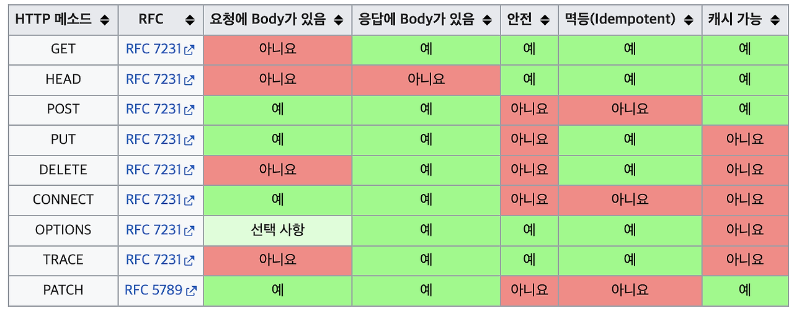
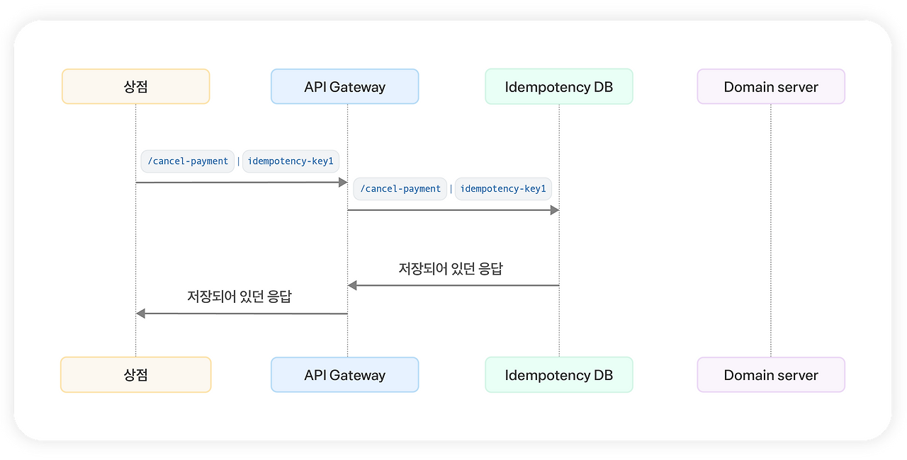

# Idempotence

HTTP 메소드의 속성
( 다른 속성으론 `Safe`, `Cacheable` )

> 여러 번 동일한 요청 보냈을 때, 서버에 미치는 의도된 영향이 동일한 경우 - RFC 7231



GET, HEAD, PUT, DELETE, OPTIONS, TRACE 

## 필요한 이유

요청의 재시도 때문이다.
-> 요청이 멱등하다면, 요청이 실패한 경우에 주저없이 재시도 요청을 하면 된다. ( 어차피 결과 같으므로 )
-> 멱등하지 않다면, 리소스가 처리되었는데 중복 요청을 보낼 수 있다.

`이미 결제된 요청인데, 중간 연결이 끊겨 다시 결제 요청을 보내는 경우`

## 멱등 여부

- GET : 리소스 조회, 멱등 O, 같은 요청을 N번 호출해도 시스템으로부터 같은 결과 조회
- POST : 리소스 생성 or 처리, 멱등 X, 같은 요청 N번 호출하면 새로운 리소스 생성 or 리소스 상태 달라지며 호출 결과 달라짐
- PUT : 리소스 대체, 같은 요청을 대체해도 항상 대상 리소스를 대체해 동일 상태로 만듬
- PATCH : 리소스 수정, 기존 리소스에 응답 추가하는 방법으로 사용시 호출 결과 달라질 수 있음
- DELETE : 리소스 삭제, N번 호출해도 항상 리소스가 없는 상태임

=> 즉, 단순한 결과 및 응답이 아니라 리소스의 상태에 대해 보장하는 것

### GET 요청이 멱등한 이유

GET 요청을 계속 보내니, 로그가 지나치게 저장되며 서버 문제르 일으키면?
-> HTTP 메소드 구현의 사이드 이펙트일뿐, 리소스에 영향이 없으므로 멱등

오직 `사용자 요청에 의한 리소스만`고려, `구현 부작용`은 고려하지 않는다.

```
User1: GET → name: Joyson, age:26
User2: PATCH → name: Joyson, age:27
User1: GET → name: Joyson, age:26
```

### PATCH 요청이 멱등하지 않은 이유

PATCH 가 생각보다 범용적으로 사용
값을 추가하는 요청에 사용된다면?

```
PATCH → name: [”Joyson”]
PATCH → name: [”Joyson”, ”Joyson”]
```

요청 결과에 따라 매번 달라진다.

### DELETE 메소드가 멱등한 이유

사용자 삭제 요청을 보내면?

처음에는 성공(200), 동일 요청 시 에러(404)를 반환한다.
```
DELETE → 200 OK
DELETE → 404 NOT FOUND
```

`리소스를 삭제해 서버에 리소스를 없게 만드는 행위`
-> DELETE 를 여러 번 호출해도 응답 상태와 무관하게 리소스가 없는 상태를 유지하도록 하는 것이다.

=> 역시, 리소스 관점에서 생각하는 것이 중요하다.

## 멱등성 구현

멱등성 키를 헤더에 담아서 식별하게 한다.

키가 존재한다면?
- 키가 존재 + 결과도 존재한다면? : 계산해둔 결과를 캐싱하고 도메인 로직 접근할 필요 없이 반환
- 키가 존재 + 결과 존재하지 않다면? : 클라이언트에 처리 중을 반환 ( 409 CONFLICT )



- 멱등성을 구현하는 서버라면, 타임아웃이 일어나도 멱등성 키를 보내 하나의 요청만 보장할 수 있다.

```javascript
const idempotencyResponses = new Map();
let cancelReq = {
  orderId: req.body.orderId
  amount: req.body.amount,
};

let idempotencyKey = req.headers.idempotencyKey || null // 요청 헤더에서 멱등키를 가져옵니다.

if (idempotencyKey != null && idempotencyResponses.has(idempotencyKey)) {
  const response = idempotencyResponses.get(idempotencyKey);
  return res.status(response.status).json(response);
};

const result = cancelProcessor.cancel(cancelReq); // 실제로 취소를 처리합니다.

if (idempotencyKey != null) {
  idempotencyResponses.set(idempotencyKey, result);
}

const responseBody = {
  message: `결제 취소 성공`,
};

return res.status(200).json(responseBody);
```

> 이떄, 요청이 들어오면
> 결과가 응답될 떄 까지 키가 비어있어 두개의 요청이 들어올 거 같다.
> ( 해당 내용은 예제라 간단하게 설명한 거 같음 )

- 400 Bad Request	멱등해야 하는 API 요청에 멱등키가 누락됐거나 형식에 맞지 않는 키값이 들어왔을 때
- 409 Conflict	이전 요청 처리가 아직 진행 중인데 같은 멱등키로 새로운 요청이 올 때
- 422 Unprocessable Entity	재시도 된 요청 본문(payload)이 처음 요청과 다른데 같은 멱등키를 또 사용했을 때
