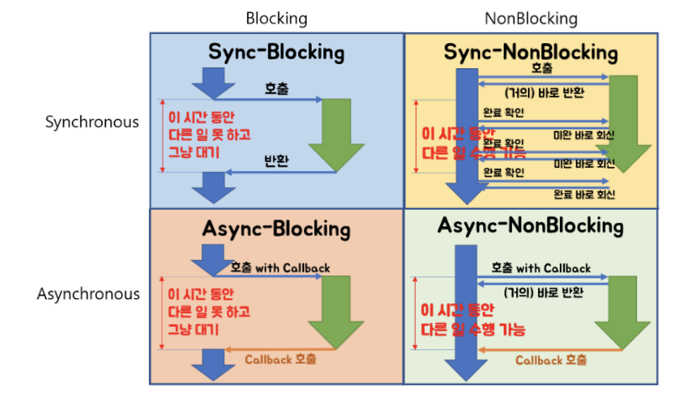

# Non-Blocking,Blocking, Synchronous, Asynchronous

Blocking - Sync
Non-Blocking - Async

이 두 개념들은 서로 같은 개념은 아니다.

핵심은 
Blocking 은 대기를 하는것
NonBlocking 은 대기를 하지 않는것 

## Blocking / Non-Blocking

`호출된 함수`가 `호출한 함수`에게 제어권 넘겨주는 유무 차이

함수 A, B가 있고 A 안에서 B를 호출했다면?
( 호출한 함수 A, 호출된 함수 B )
-> 즉, B가 호출되며 자신의 일을 진행 ( 제어권은 B에게 주어진 상황 )

- Blocking : 함수 B는 자신의 일을 다 마칠 때 까지 제어권 가지고 있음. A는 B가 마칠 때 까지 대기
- Non-Blocking : 함수 B는 자신의 일을 마치지 않더라도 A에게 제어권 바로 넘겨줌. A는 B를 기다리면서 다른 일 진행

=> 호출된 함수에서 일 시작할때 바로 제어권 리턴해주는지, 할 일 마치고 리턴해주는지 따라 나누어짐

## Synchronous / Asynchronous

일을 수행중인 `동시성`에 주목하자

- Synchronous : 함수 A는 B가 하는 일 기다리며, 현재 상태가 어떤지 체크
- Asynchronous : 함수 B의 수행 상태를 B 혼자 직접 신경쓰며 처리한다. - callback

=> 호출된 함수(B)를 호출한 함수가(A)가 신경쓰는지, 호출된 함수(B) 스스로 신경쓰는에 따라 달라진다.

- Future / CompletableFuture 는 Async + Non-Blocking 방식이다.
  - `get()`,`join()`시에 블로킹 발생한다.
- 일반적인 `br.readLine()` `io` 는 데이터를 읽고 쓰는동안 Sync + Blocking 방식이다.
- `nio` 는 Sync(Async) + Non Blocking 방식이다.
  - `SocketChannel` 은 데이터 준비 안될시 제어권 반환, 그 후 반복적으로 폴링해서 이벤트를 감지하는 구조
  - 자바 7 이후,`nio.2`에선 `AsynchronousSocketChannel` 을 사용하면 호출 스레드가 작업 요청 후 즉시 다른 작업 진행
    IO 작업 완료 시점에 비동기적으로 후처리

